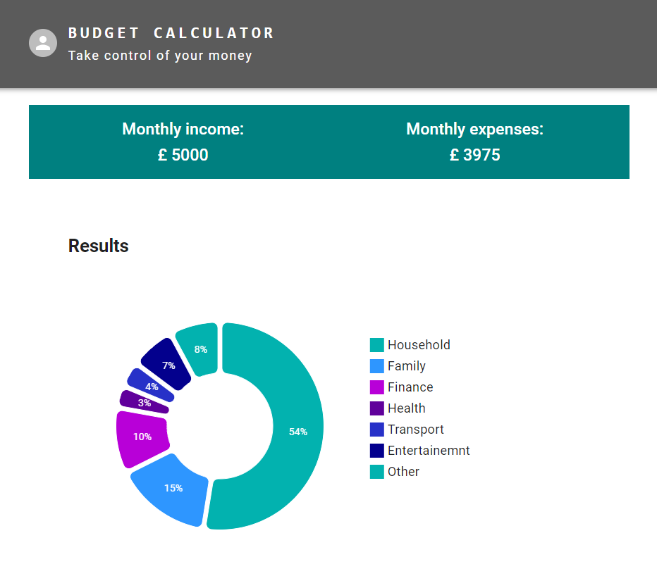

## Sungharsh-Jarathi - <a href="https://sungharsh.github.io/" target="_blank">sungharsh.github.com </a>

## 🚀 Budget Calculator App

[]

## 💎 Libraries used

- Create React App,
- Typescript,
- Jest,
- React-Testing-library,
- Material-UI,
- eslint,
- Prettier,
- simple-import-sort
- use-immer
- @mui/x-charts

## 🔥 Motivation

This is a practice project aimed at creating a Single Page Application (SPA) designed to assist individuals in assessing and optimizing their personal budget planning. The primary technologies I have employed for this project include ReactJS, focusing on its core features. To manage the application's state, I will utilize the Context API, while for unit testing, React-Testing-Library and Jest and for styling Material-UI and for charts MUI X-charts will be my tools of choice. There is a lot of scope to add more fetures and improve, but I have concluded fruther development on this app due to time constrains.
